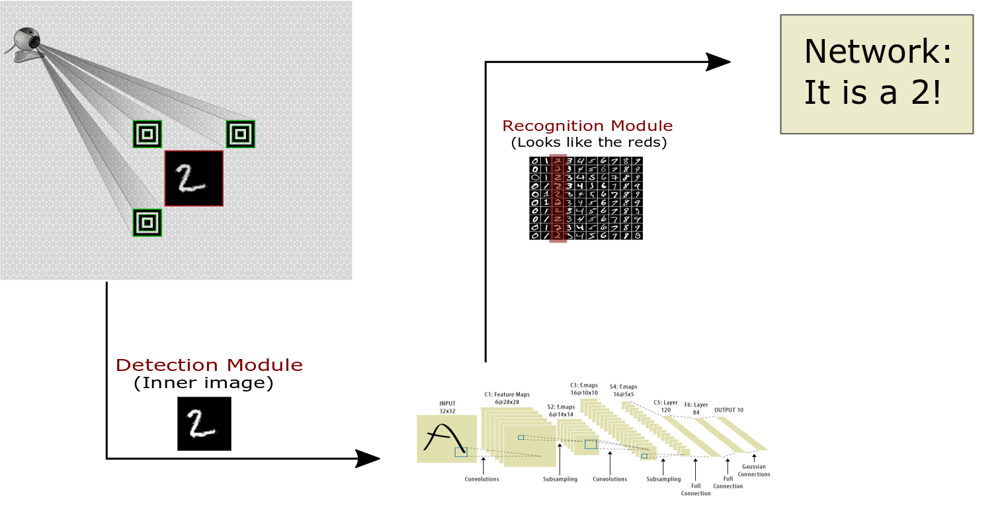

# Description

This application combines **Computer Vision** and **Machine Learning (Deep Learning)** to detect and recognise a digit from the **MNIST** database. The detection module uses the OpenCV library to extract a part of the image acquired from a Web Camera which is on the inside of 3 Markers (check [files/imageWithMarkers.png](files/imageWithMarkers.png)). The recognition module uses the Caffe framework and the **LeNet CNN** to classify the image and finally recognise the digit.

**Detection Module**. Exploits the property that the concentric squares (Markers) have Contours with the same Mass Center. Using OpenCV, we **detect** the Markers and **extract** the inner image. 
*[It should work with other concentric shapes as well!]*

**Recognition Module**. It uses the pretrained-model ([resourceFiles/trained_model.caffemodel](resourceFiles/trained_model.caffemodel)) and the network model ([resourceFiles/lenet_architecture.prototxt](resourceFiles/lenet_architecture.prototxt)) to recognise the digit in the image.

*[You can use your network architecture and pre-trained model.]*

 

**Click image to wacth a demo**

 
# Getting Started
## Installing
Clone or download and compile.

## Prerequisites

* If you want to run only the detection module you need **OpenCV** (**2.4** or **3.1** are ok).
* If you want to run both you need **Caffe Framework**.

# Usage

1. Change the **paths** of the needed files of the Recognition Module. 
1. Print or display some **images** with the markers.
1. **Place** your Web Cam in front of the printed image or diplay.
1. Check the **Result** to see that the digit was recognised.

# Built With
* OpenCV 3.1
* Caffe framewrok
* QtCreator IDE 5.9.2 with the MSVC 2015 Kit (on Windows 10)

# Future Work

In order to extract the image from the inside of the markers, we apply an affine transformation, which warps the inner image. Since our model is not trained in warped images, the network performance will decrease. To resolve this issue we will train a **[1] Spatial Transformer Network** in a distorted MNIST database, which we expect to give us better results.

[1] Jaderberg, Max, Karen Simonyan, and Andrew Zisserman. "Spatial transformer networks." Advances in Neural Information Processing Systems. 2015.

# Acknowledgments

Thanks to [DSYNFLO](http://dsynflo.blogspot.ch/2014/10/opencv-qr-code-detection-and-extraction.html) for his valuable information and code on how to find the orientation of the Markers.

